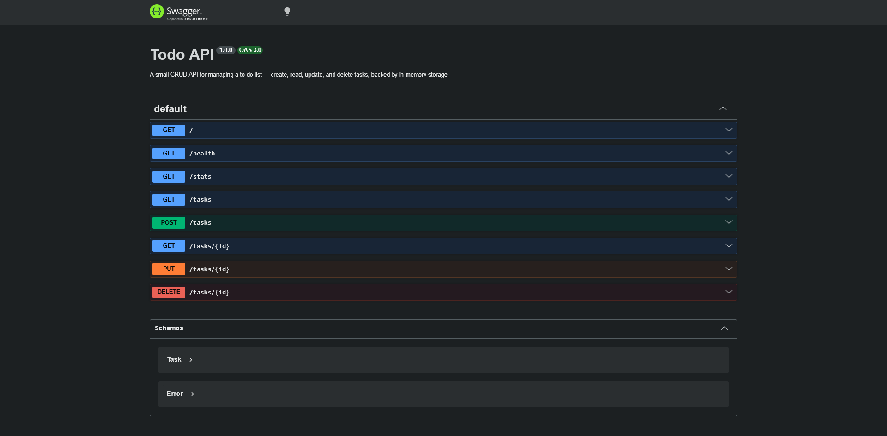

# Task API

A small CRUD API for managing a to-do list, create, read, update, and delete tasks, with interactive docs via Swagger UI.

This is a solution for the assignment: **W2 · A1 — Build your first CRUD API**
Assignment link: [BE-01](https://internship.flyrank.ai/intern/assignments/BE-01)

## Tech stack

- **Node.js** + **Express**
- **`node:sqlite`** (`DatabaseSync`, in-memory mode) for storage
- **swagger-jsdoc** + **swagger-ui-express** for interactive API docs
- **pnpm** as package manager

> **Note on storage:** this uses `node:sqlite` with `:memory:` mode instead of a plain array/Map. Data is not persisted to disk and is lost on restart, satisfying the same in-memory constraint as the assignment — this was a deliberate choice to practice SQL.

## Install & run

```bash
pnpm install
pnpm start
```

Server runs on `http://localhost:3000`.

(Optional, for auto-restart during development: `pnpm dev`)

## Endpoints

| Method | Path         | Description                       |
| ------ | ------------ | --------------------------------- |
| GET    | `/`          | API info                          |
| GET    | `/health`    | Health check                      |
| GET    | `/stats`     | Stats endpoint                    |
| GET    | `/tasks`     | List all tasks                    |
| GET    | `/tasks/:id` | Get a single task by id           |
| POST   | `/tasks`     | Create a new task                 |
| PUT    | `/tasks/:id` | Update a task's title and/or done |
| DELETE | `/tasks/:id` | Delete a task                     |

## API docs (Swagger UI)

Interactive documentation with a "Try it out" button is available at:

```
http://localhost:3000/docs
```


