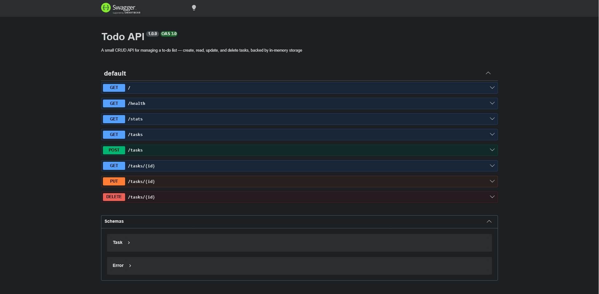

# Task API

A small CRUD API for managing a to-do list, create, read, update, and delete tasks, with interactive docs via Swagger UI.

This is a solution for the assignment:

- **W3 · A1 — Connecting your CRUD to the database** - Assignment link: [BE-02](https://internship.flyrank.ai/intern/assignments/CUSTOM-MRNC9HQC-956E8C0B)
- **W3 · A2 - Containerize your stack** - Assignment link: [BE-04](https://internship.flyrank.ai/intern/assignments/BE-04)

## Tech stack

- **Node.js** (ESM) + **Express**
- **PostgreSQL 16** for storage, running in Docker
- **Docker** + **Docker Compose** for containerization and local orchestration
- **swagger-jsdoc** + **swagger-ui-express** for interactive API docs
- **pnpm** as package manager

> **Note on storage:** this week's version migrates off `node:sqlite` (in-memory) from the previous assignment to a real **PostgreSQL** database running in its own container, with data persisted via a named Docker volume. The schema is created automatically on first boot via an init script (`init-scripts/schema.sql`).

> **Note on modules:** the codebase was also refactored from CommonJS to **ESM** (`import`/`export`) this week.

## Running with Docker (recommended)

**1. Copy the example env file and fill in your own values:**

```bash
cp .env.example .env
```

**2. Build and start everything (API + Postgres):**

```bash
docker compose up -d --build
```

**3. Check both services are healthy:**

```bash
docker compose ps
```

Server runs on `http://localhost:3000`.

**Useful commands:**

```bash
docker compose logs -f api      # tail API logs
docker compose logs -f database # tail Postgres logs
docker compose down             # stop everything (data persists)
docker compose down -v          # stop and wipe the database volume
```

## Running without Docker (local dev)

Requires a local PostgreSQL instance and a `.env` pointing `DATABASE_URL` at it.

```bash
pnpm install
pnpm start
```

(Optional, for auto-restart during development: `pnpm dev`)

## Endpoints

| Method | Path         | Description                       |
| ------ | ------------ | --------------------------------- |
| GET    | `/`          | API info                          |
| GET    | `/health`    | Health check                      |
| GET    | `/stats`     | Stats endpoint                    |
| GET    | `/tasks`     | List all tasks                    |
| GET    | `/tasks/:id` | Get a single task by id           |
| POST   | `/tasks`     | Create a new task                 |
| PUT    | `/tasks/:id` | Update a task's title and/or done |
| DELETE | `/tasks/:id` | Delete a task                     |

## API docs (Swagger UI)

Interactive documentation with a "Try it out" button is available at:

```
http://localhost:3000/docs
```


